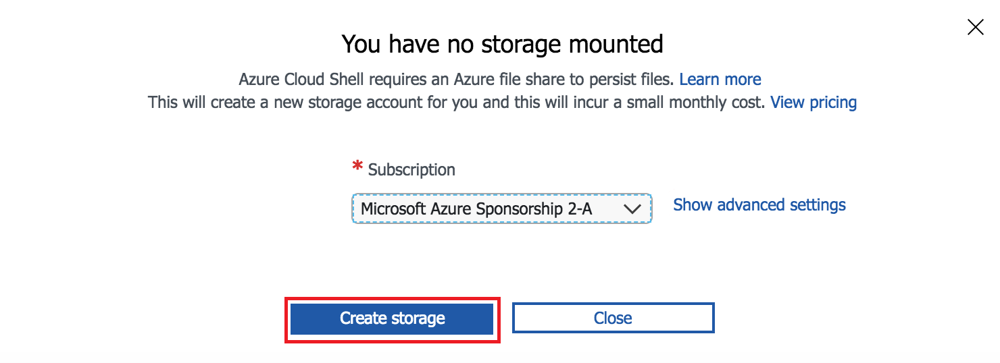

# Configuração do Ambiente do Lab

Esses laboratórios geralmente são entregues pelo **Azure Global Blackbelt Team**. Mas vamos adaptar o seu conteúdo e executá-lo usando uma subscrição de Azure (fornecido no evento) e uma VM de Linux com todas as ferramentas necessárias já instaladas.

## Setup do Ambiente

### 1. Azure Cloud Shell

1. Navegue até http://portal.azure.com
2. Logue-se com as credenciais de Azure fornecidas durante o evento.
3. Clique no ícone do Cloud Shell para iniciar sua sessão.

    

4. Selecione `Bash (Linux)`

5. Clique em `Create storage`

    

> Nota: Você também pode usar uma sessão dedicada do Azure Cloud Shell através da URL: http://shell.azure.com 

### 2. Deploy de sua Linux VM

1. Abra uma sessão do Cloud Shell e use os seguintes comandos:

```bash
$ wget https://raw.githubusercontent.com/CSELATAM/global-devops-bootcamp/master/deploy-lab.sh
$ chmod +x deploy-lab.sh
$ ./deploy-lab.sh VHDURL
```

## Auto-guiado

É possível fazer o laboratório em sua própria máquina. Você precisará dos seguintes componentes disponíveis/instalados:

* Conta de Azure
* Conta no GitHub e git tools
* Linux, Mac ou Windows com Bash
* Docker
* Azure CLI
* Kubernetes CLI (kubectl)
* MongoDB (apenas o lab #1 precisa dele)
* Visual Studio Code (ou outro editor)
