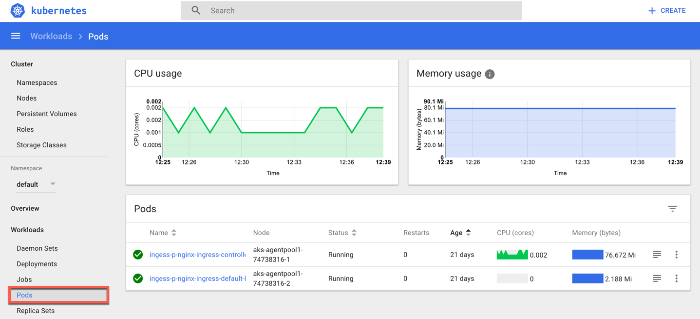

# Kubernetes Dashboard

The Kubernetes dashboard is a web ui that lets you view, monitor, and troubleshoot Kubernetes resources.

> Note: The Kubernetes dashboard is a secured endpoint and can only be accessed using the SSH keys for the cluster. Since cloud shell runs in the browser, it is not possible to tunnel to the dashboard using the steps below.

```bash
ssh -L 8001:localhost:8001 azureuser@104.41.132.133
```

```bash
kubectl proxy &
```

### Accessing The Dashboard UI

There are multiple ways of accessing Kubernetes dashboard. You can access through kubectl command-line interface or through the master server API. We'll be using kubectl, as it provides a secure connection, that doesn't expose the UI to the internet.

1. Command-Line Proxy

    * Open an RDP session to the jumpbox IP with username and password
    * Run ```az login``` to authenticate with Azure in order to use Azure CLI in the Jumpbox instead of Cloud Shell
    * Run ```NAME=$(az group list -o table | grep ODL | awk '{print $1}')``` in order to retrieve the name of the resource group for your Azure account and put it in the NAME variable.
    * Run ```CLUSTER_NAME="${NAME//_}"``` in order to retrieve the cluster name (to remove the underscore)
    * Run ```az aks get-credentials -n $CLUSTER_NAME -g $NAME``` in order to get the credentials to access our managed Kubernetes cluster in Azure
    * Run ```kubectl proxy```
    * This creates a local proxy to 127.0.0.1:8001
    * Open a web browser (Firefox is pre-installed on the Jumpbox) and point to: <http://127.0.0.1:8001/api/v1/proxy/namespaces/kube-system/services/kubernetes-dashboard/#!/cluster?namespace=default>

### Explore Kubernetes Dashboard

1. In the Kubernetes Dashboard select nodes to view

2. Explore the different node properties available through the dashboard
3. Explore the different pod properties available through the dashboard 
4. In this lab feel free to take a look around other at  other resources Kubernetes provides through the dashboard

> To learn more about Kubernetes objects and resources, browse the documentation: <https://kubernetes.io/docs/user-journeys/users/application-developer/foundational/#section-3>
