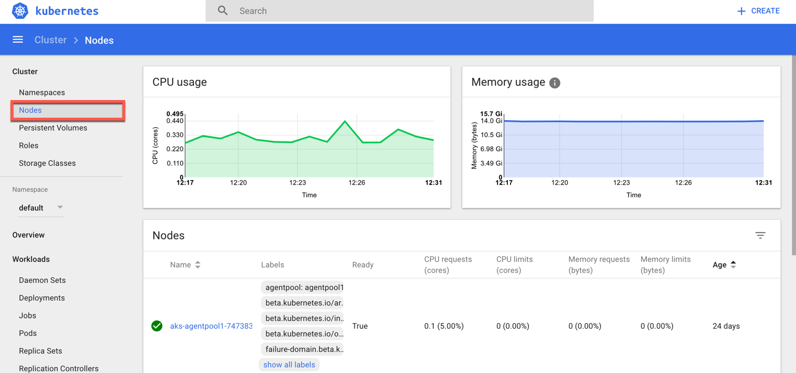

# Dashboard do Kubernetes

The Kubernetes dashboard is a web ui that lets you view, monitor, and troubleshoot Kubernetes resources.

> Note: The Kubernetes dashboard is a secured endpoint and can only be accessed using the SSH keys for the cluster. Since cloud shell runs in the browser, it is not possible to tunnel to the dashboard using the steps below.

## Acessando a UI da Dashboard

Existem várias maneiras de acessar a dashboard do Kubernetes. Em sua máquina local, você poderia simplesmente usar o comando `kubectl proxy` para criar um túnel seguro entre a API do Kubernetes e seu computador - não expondo a UI para a internet. Mas como estamos usando uma VM entre nosso computador e o cluster, precisamos criar parte do túnel via ssh.

* Crie o túnel:

    ```bash
    ssh -L 8001:localhost:8001 azureuser@xyz.xyz.xyz.xyz
    ```

* Em seguida, já logado na VM, faça:

    ```bash
    kubectl proxy &
    ```

* Abra a UI em um navegador em sua máquina local (Chrome, Firefox, Edge, etc) e navegue até <http://127.0.0.1:8001/api/v1/proxy/namespaces/kube-system/services/kubernetes-dashboard/#!/cluster?namespace=default>

### Explorando a Dashboard do Kubernetes

1. Em sua Dashboard do Kubernetes Dashboard, vá na aba de nós para visualiza-los.

2. Explore as diferentes propriedades e métricas dos nós disponiveis através da dashboard.
3. Explore as diferentes propriedades expostas pelo menu de pods.

4. Explore os serviços e suas propriedes.
5. Veja o secret que foi deployado.
5. Neste laboratório, fique livre para explorar outros conceitos de Kubernetes que foram abordados anteriormente, disponíveis através da dashboard do Kubernetes.

> Para aprender mais sobre os objetos e modelos do Kubernetes, não há melhor lugar para visitar do que a documentação oficial:
> * https://kubernetes.io/docs/concepts/
> * <https://kubernetes.io/docs/user-journeys/users/application-developer/foundational/#section-3>
