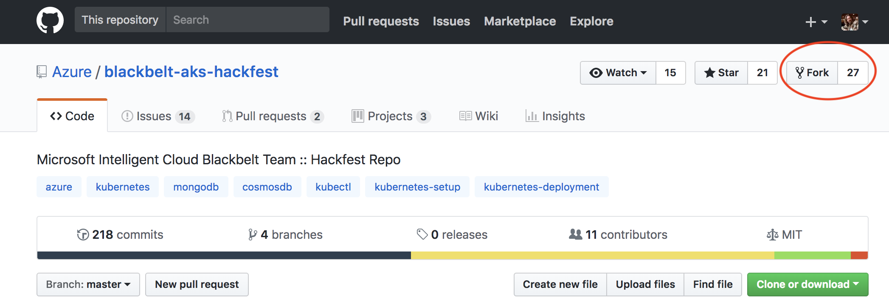
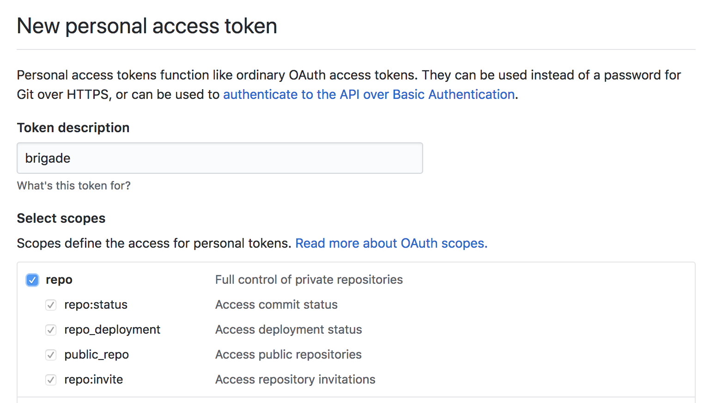
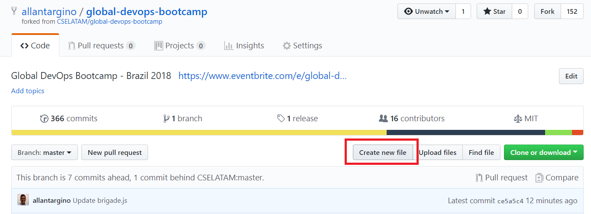
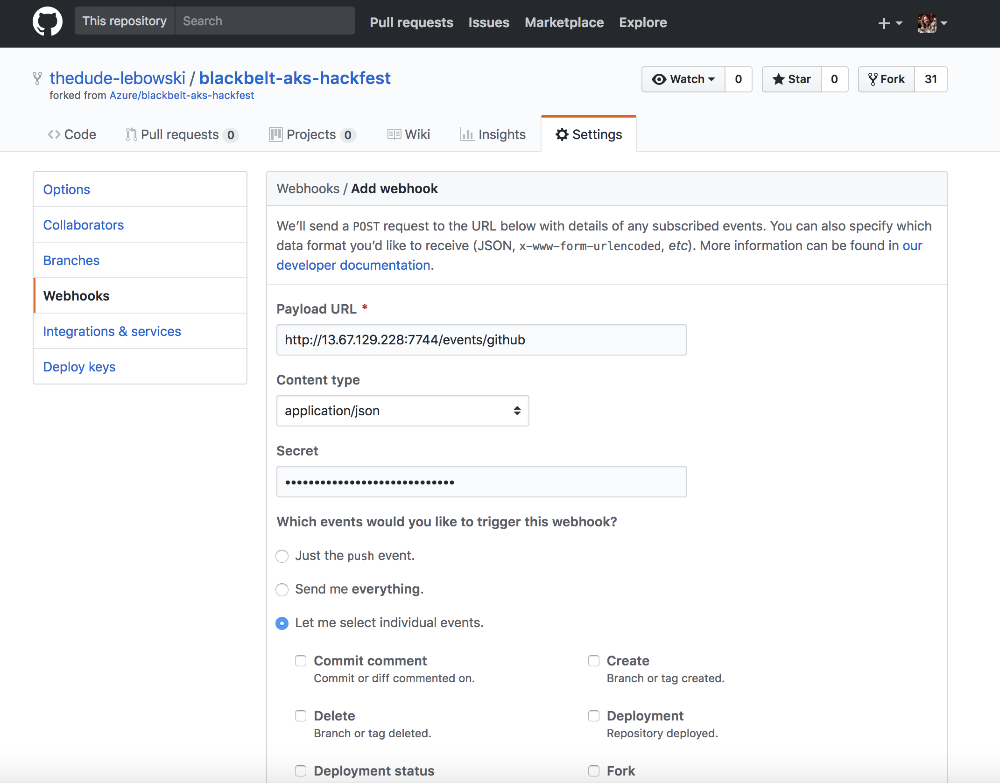

# CI/CD com Brigade

Nesse lab, nós vamos usar Brigade (>=0.11.0) para automarizar o build e o delivery da nossa aplicação web para o nosso cluster de AKS.

Aprenda e veja mais detalhes sobre Brigade aqui: http://brigade.sh 

> Nota: Nós escolhemos usar Brigade aqui, mas outras ferramentas como Jenkins poderiam fazer as mesmas funções.

## Configurar o Helm

Caso você esteja fazendo o laboratório em sua VM Linux, o cliente do helm já foi instalado.

Use o comando abaixo pra instalar Tiller (componente server do Helm) em seu cluster de Kubernetes:

```bash
helm init
```

Verifique que o comando abaixo retorna uma resposta tanto do `Client` quanto do `Server`.

```bash
$ helm version

Client: &version.Version{SemVer:"v2.9.1", GitCommit:"20adb27c7c5868466912eebdf6664e7390ebe710", GitTreeState:"clean"}
Server: &version.Version{SemVer:"v2.9.1", GitCommit:"20adb27c7c5868466912eebdf6664e7390ebe710", GitTreeState:"clean"}
```

Para este laboratório, você precisará ter uma conta no Github. Caso não tenha, faça seu cadastro [aqui](https://github.com/join). Como exemplo, estaremos usando a conta `https://github.com/thedude-lebowski`, mas lembre-se de trocar tais valores para a sua conta.

## Instalar o Brigade

1. Atualiza os repos do helm

    ```bash
    helm repo add brigade https://azure.github.io/brigade
    ```

2. Instale o chart do brigade

    ```bash
    # k8s pre-1.8
    helm install -n brigade brigade/brigade --set vacuum.enabled=false
    ```

    Confira o status da instalação

    ```bash
    helm status brigade
    ```

    Você deve ver 3 pods

    ```bash
    $ kubectl get pods | grep brigade

    brigade-brigade-api-884998b78-h4qt5     1/1       Running   0          41s
    brigade-brigade-ctrl-576bc44775-g9nht   1/1       Running   0          41s
    brigade-brigade-gw-84c5dbf7f9-hfzqq     1/1       Running   0          41s
    ```

## Fork do Repo do GitHub

1. Abra o Github e logue-se com sua conta
2. Vá até to https://github.com/CSELATAM/global-devops-bootcamp
3. Clique em `Fork` para copiar o nosso repositório em sua conta

    

## Configurar o projeto do Brigade

1. Crie um arquivo YAML para o projeto do brigade

    * Crie um arquivo chamado `brig-proj-heroes.yaml`
    * Adicione o conteúdo abaixo em seu arquivo para começar a editá-lo

        ```yaml
        project: "TROCAR"
        repository: "TROCAR"
        cloneURL: "TROCAR"
        sharedSecret: "crie-algo-super-secreto"
        # TROQUE ISSO AQUI ACIMA! É basicamente uma senha.
        github:
          token: "TROCAR"
        secrets:
          acrServer: TROCAR
          acrUsername: TROCAR
          acrPassword: "TROCAR"
        vcsSidecar: "deis/git-sidecar:v0.11.0"
        ```

    * Edite os valores acima para serem as mesmas da sua conta do GitHub (há um exemplo logo abaixo)
        * *project*: thedude-lebowski/global-devops-bootcamp
        * *repository*: github.com/thedude-lebowski/global-devops-bootcamp
        * *cloneURL*: https://github.com/thedude-lebowski/global-devops-bootcamp.git

    * Crie um personal access token do Github token e atualize o `brig-proj-heroes.yaml`
        * Em seu Github, clique em `Settings` e depois em `Developer settings`
        * Selecione `Personal sccess tokens`
        * Selecione `Generate new token`
            
        * Dê uma descrição e acesso a `repo`
            

        > Nota: Mais detalhes entre a integração do Brigade com o GitHub podem ser encontradas aqui: https://github.com/Azure/brigade/blob/master/docs/topics/github.md

    * Pegue as suas credenciais do ACR (Azure Container Registry) pelo portal do Azure (as mesmas usadas anteriormente). Edite o arquivo `brig-proj-heroes.yaml` usando esses valores
        * acrServer
        * acrUsername
        * acrPassword

    * Depois das etapas acima, seu arquivo deve parecer com o abaixo (os valores são apenas exemplos, não são reais)

        ```yaml
        project: "thedude-lebowski/global-devops-bootcamp"
        repository: "github.com/thedude-lebowski/global-devops-bootcamp"
        cloneURL: "https://github.com/thedude-lebowski/global-devops-bootcamp.git"
        sharedSecret: "9485fdde3b53d8347e9e4d711ae2ae0e287d2d38"
        github:
          token: "58df6bf1c6bogus73d2e76b54531c35f45dfe66c"
        secrets:
          acrServer: youracr.azurecr.io
          acrUsername: youracr
          acrPassword: "lGsP/UA1Gnbogus9Ps5fAL6CeWsGfPCg"
        vcsSidecar: "deis/git-sidecar:v0.14.0"
        ```

2. Crie seu projeto do brigade

    ```bash
    # no mesmo diretório do arquivo que criamos na etapa anterior
    helm install --name brig-proj-heroes brigade/brigade-project -f brig-proj-heroes.yaml
    ```

    > Nota: Existe um CLI chamado `brig`, que permite que você visualize e interaja com seus projetos do brigade. Mais detalhes aqui: <https://github.com/Azure/brigade/tree/master/brig>

## Configurar o Pipeline do Brigade

1. Em seu fork do repositório no GitHub, crie (na raíz do seu projeto) um arquivo chamado `brigade.js` (dentro da própria interface web do Github)

2. Cole o conteúdo do arquivo de exemplo [brigade.js](../helper-files/brigade.js) neste arquivo.
3. Commite o novo arquivo.
4. Revise e estude um pouco a sintaxe dos passos executados no javascript que rodam os jobs em seu pipeline.

## Adicione o Dockerfile para o web app

Nos nossos labs passados, nós tivemos que criar um `Dockerfile` para o web app. Dado que você fez o fork do repo, você terá que fazer isso de novo.

* No diretório `~/global-devops-bootcamp/app/web`, dentro da própria interface web do Github, adicione um arquivo chamado `Dockerfile`
* Adicione as seguintes linhas e salve (isso será usado pelo brigade depois)

    ```Dockerfile
    FROM node:9.4.0-alpine

    ARG VCS_REF
    ARG BUILD_DATE
    ARG IMAGE_TAG_REF

    ENV GIT_SHA $VCS_REF
    ENV IMAGE_BUILD_DATE $BUILD_DATE
    ENV IMAGE_TAG $IMAGE_TAG_REF

    WORKDIR /usr/src/app
    COPY package*.json ./
    RUN npm install

    COPY . .
    RUN apk --no-cache add curl
    EXPOSE 8080

    CMD [ "npm", "run", "container" ]
    ```

## Configurar o Webhook do Github

1. Pegue a URL do seu gateway do brigade para o Github

    ```bash
    $ kubectl get service brigade-brigade-github-gw

    NAME                 TYPE           CLUSTER-IP    EXTERNAL-IP     PORT(S)          AGE
    brigade-brigade-gw   LoadBalancer   10.0.45.233   13.67.129.228   7744:30176/TCP   4h
    ```

    Monte a URL do webhook seguindo o padrão do exemplo abaixo (substituindo pelo seu IP e porta):
    > http://13.67.129.228:7744/events/github

    Troque pelo seu IP:

    > http://xyz.xyz.xyz.xyz:7744/events/github

    Você usará essa URL no seu próximo passo.

2. In your forked Github repo, click on Settings
3. Click Webhooks
4. Click `Add webhook`
5. Set the `Payload URL` to the URL created in step 1
6. Set the `Content type` to `application/json`
7. Set the `Secret` to the value from your `brig-proj-heroes.yaml` called "sharedSecret"
8. Set the `Which events...` to `Let me select individual events` and check `Push` and `Pull request`

    

9. Click the `Add webhook` button

## Test the CI/CD Pipeline

1. Update the web application. Directly in your forked Github repo, edit the `Footer.vue` file. Stored in: `global-devops-bootcamp/app/web/src/components/`
2. Find the snippet below *(line 13)* and change the text _"Azure Global Blackbelt Team"_ to your name or whatever you would like to display.

    ```
    <div class="row at-row flex-center flex-middle">
      <div class="col-lg-6">
      </div>
      <div class="col-lg-12 credits">
        Azure Global Blackbelt Team
      </div>
      <div class="col-lg-6">
      </div>
    </div>
    ```

3. Click `Commit changes` in Github. Provide a commit message if you would like.
4. List the pods in the cluster (`kubectl get pods`). You should see Brigade worker and jobs running.
5. If this completes successfully, you will see your updated web app (acesse a URL pública do seu serviço web)

> Nota: Estude os logs dos pods e entende mais profundamente o funcionamento do framework.
> 